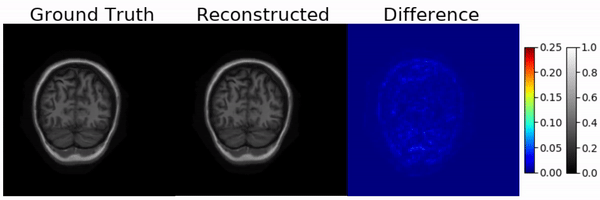

## Structure Preserving Compressive Sensing MRI Reconstruction using Generative Adversarial Networks

This is the official implementation code for **[Structure Preserving Compressive Sensing MRI Reconstruction using Generative Adversarial Networks](https://arxiv.org/abs/1910.06067)** accepted in IEEE CVPR Workshop on [New Trends in Image Restoration and Enhancement (NTIRE)](https://data.vision.ee.ethz.ch/cvl/ntire20/) 2020.

> #### Authors
> [Puneesh Deora](https://scholar.google.com/citations?user=cn1wdTUAAAAJ&hl=en)\*, [Bhavya Vasudeva](https://scholar.google.com/citations?user=ZCSsIokAAAAJ&hl=en)\*, [Saumik Bhattacharya](https://scholar.google.com/citations?user=8pffuA4AAAAJ&hl=en), [Pyari Mohan Pradhan](https://scholar.google.com/citations?user=_eIpqasAAAAJ&hl=en) <br>
> (* equal contribution)

## Teaser
<p align="left"></p>

## Pre-requisites
The code was written with Python 3.6.8 with the following dependencies:
* cuda release 9.0, V9.0.176
* tensorflow 1.12.0
* keras 2.2.4
* numpy 1.16.4
* scikit-image 0.15.0
* matplotlib 3.1.0
* nibabel 2.4.1
* cuDNN 7.4.1

This code has been tested in Ubuntu 16.04.6 LTS with 4 NVIDIA GeForce GTX 1080 Ti GPUs (each with 11 GB RAM).

## How to Use
### Preparing data
1. Downloading the dataset:

&nbsp; &nbsp; &nbsp; **MICCAI 2013 dataset:** 
* The MICCAI 2013 grand challenge dataset can be downloaded from this [webpage](https://my.vanderbilt.edu/masi/workshops/). It is required to fill a google form and register be able to download the data.
* Download and save the `training-training` and `training-testing` folders, which contain the training and testing data, respectively, into the repository folder.

&nbsp; &nbsp; &nbsp; **MRNet dataset:** 
* The MRNet dataset can be downloading from this [webpage](https://stanfordmlgroup.github.io/competitions/mrnet/). It also requires to register by filling the form at the end of the page to be able to download the data.
* Download and save the `train` and `valid` folders, which contain the training and testing data, respectively, into the repository folder.

2. Run the following command to create the GT dataset:
```
python dataset_load.py
```
3. Run the following command to create the undersampled dataset:
```
python usamp_data.py
```
4. These files would create the training data using MICCAI 2013 dataset. For MRNet dataset, or for testing data, please read the comments in the files to make the necessary changes.
5. The `masks` folder contains the undersampling masks used in this work. The path for the mask can be modified in `usamp_data.py`, as required.

### Training
1. Run the following command to train the model, after checking the names of paths:
```
python training_model.py
```

### Testing
#### Testing the trained model:
1. Run the following command to test the model, after checking the names of paths:
```
python test_model.py
```

#### Testing the pre-trained model:
1. The pre-trained generator weights are available at: [20% undersampling](https://drive.google.com/open?id=1ygzSDA4V09qVhThiYJ606ec912BYjBfP), [30% undersampling](https://drive.google.com/open?id=1j2PPdPT4nOgW8QmhgHJDjMarJUp6gvM6). Download the required weights in the repository folder. They can used to obtain the results as provided in the paper.
2. Run the following command, after changing the names of paths:
```
python test_model.py
```
## Citation
If you find our research useful, please cite our work.
```
@inproceedings{deora2019structure,
    title={Structure Preserving Compressive Sensing MRI Reconstruction using Generative Adversarial Networks},
    author={P. Deora and B. Vasudeva and S. Bhattacharya and P. M. Pradhan},
    booktitle={The IEEE Conference on Computer Vision and Pattern Recognition (CVPR) Workshops}
    year={2020}
}
```

## License
```
   Copyright 2020 Authors

   Licensed under the Apache License, Version 2.0 (the "License");
   you may not use this file except in compliance with the License.
   You may obtain a copy of the License at

       http://www.apache.org/licenses/LICENSE-2.0

   Unless required by applicable law or agreed to in writing, software
   distributed under the License is distributed on an "AS IS" BASIS,
   WITHOUT WARRANTIES OR CONDITIONS OF ANY KIND, either express or implied.
   See the License for the specific language governing permissions and
   limitations under the License.
```
